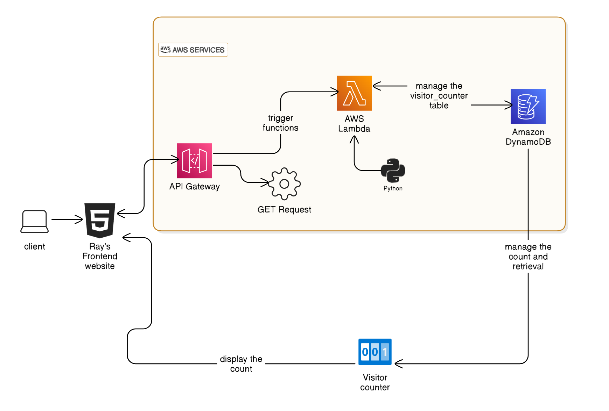

## AWS ☁️ Cloud Resume Challenge 🚀

This is inspired by the [Cloud Resume Challenge](https://cloudresumechallenge.dev/docs/the-challenge/aws/).

The architecture diagram above illustrates the workflow of the Backend it starts off by: 

1. Pushing a commit to the [aws-crc-backend](https://github.com/araxia55/aws-crc-backend) repo.
2. The commits are picked up by Github Actions and triggers the `deploy-backend` pipeline to build and deploy the infrastructure.
3. The integration of the backend and frontend is done thru AWS API Gateway wherein the API invokes the Lambda function to manage the `visitor_counter` table and then return the visitor's count. The visitor's count is then displayed at each footer of [raymund.cloud](https://www.raymund.cloud) by employing a JS counter logic.

#### Backend Section

1. Python Lambda: This is a serverless compute service that runs your code in response to events and automatically manages the underlying compute resources for you.

2. API Gateway: This is a fully managed service that makes it easy for developers to create, publish, maintain, monitor, and secure APIs at any scale.

3. DynamoDB: This is a NoSQL database service that delivers fast and predictable performance with seamless scalability.
4. Terraform: This is Infrastructure as code software tool that provides a consistent CLI workflow to manage hundreds of cloud services.

These components work together to create a backend system that can handle incoming requests (through API Gateway), process the data (with Python Lambda), and store the data (in DynamoDB). Terraform is used to provision and manage the infrastructure, ensuring that everything is properly configured and integrated.

